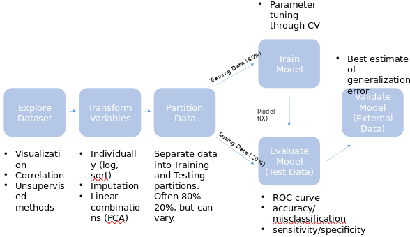
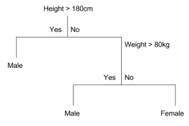
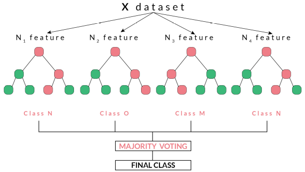

## Mod 2: Machine Learning in R

When inference is not critical or the objective we may not need as many assumptions (normality, linearity, heteroscedasticity, etc). In these cases, instead of determining if our model fits well we can focus on optimizing predictive accuracy.

In statistics, we strive to prove our model with converge to the correct model as the amount of data increases. In machine learning, the focus is usually on a **generalization bound**, which tells us how well unseen observations can be predicted.

### Common Terms

-   Labels - outcome and dependent variable

-   Loss function - some comparison between outcome and prediction

-   Features - X: what we call covariates, independent variables, etc

-   Weights, bias - Similar to beta coefficients and intercepts

-   Optimization - A procedure that minimizes w, such that solving the derivative or gradient descent

-   Tuning Parameters - Values that control the amount of regularization or complexity of an algorithm

### Type of Machine Learning

-   Unsupervised learning - No label Y available -\> clustering, dimension reduction of X

    -   Principal Component Analysis (PCA)

    -   K-means

    -   Hierarchical clustering

-   Supervised learning - Weighting or partitioning X based on labels Y

    -   Decision trees/Random Forest

    -   Support Vector Machines (SVM)

    -   Gradient Boosting, xgboost

    -   Neural Networks

    -   Regression

-   Reinforcement learning - learn a policy by getting rewards for actions taken

## Unsupervised Learning - PCA

Takes a metric of features X = [X1, X2... Xn] and calculates a new set of linear combinations of X called **principal components.**

-   It is a decomposition of covariance matrix

-   PCs are ranked by how much variation in the data each one explains. Thus, PC1 vs PC2 will usually contain the most information

-   Useful for looking at patterns and groupings along these dimensions

-   Requires scaling of variables, detects linear correlations

-   In R: `precomp(x)`

## K-Means Clustering

The matrix of features X and a number of clusters k and partitions the observations in *k* clusters that minimize within-cluster distance.

-   Uses a set of initial group "centroids"

-   For each observation, computes the distance from each centroid and assigns it to a group defined by the closest centroid

-   Once finished uses each defined group to compute a set of new group centroids

-   Repeat until convergence (group assignments no longer change)

-   Has to use Euclidean distance

-   Sometimes converges to local minima instead of global

## Hierarchical Clustering

Takes a matrix of features X and computes distances between observations and distances between observations (linkages).

**Agglomerative** - Each observation starts in its own cluster of size one. Each cluster is iteratively grouped with its nearest cluster until all observation are grouped together. Then the hierarchy of groupings is saved

**Divisive** - Inversely, all observations start in one cluster and at each step the largest remaining cluster is broken up until all observations are separated. Then the hierarchy of grouping is saved.

-   One advantage over k-means is that any distance metric can be used, and variation in distance metric and linkage can change clustering

-   In R `hclust(dist(x))` where `dist()` computes pairwise distances between all observations in X

#### Unsupervised Learning Example

```{r}
head(iris)
```

```{r}
# Prinipal component decomposition
iris_x <- iris[, 1:4]
iris_pc <- prcomp(iris_x)
plot(iris_pc$x[,1:2])
```

Based on the PC graph we can infer there may be two different clusters/groups

```{r}
par(mfrow=c(1,3), mar = c(5,5,1,1))
# K-Means Clustering
iris_k2 <- kmeans(iris_x, 2)
# Take a vectors of colors length 2 and assign to clusters
plot(iris_pc$x[,1:2], col = rainbow(2)[iris_k2$cluster])

iris_k3 <- kmeans(iris_x, 3)
plot(iris_pc$x[,1:2], col = rainbow(3)[iris_k3$cluster])

iris_k4 <- kmeans(iris_x, 4)
plot(iris_pc$x[,1:2], col = rainbow(4)[iris_k4$cluster])
```

```{r}
par(mfrow=c(2,1), mar = c(5,5,1,1))
plot(iris_pc$x[,1:2], col = iris$Species, main = "True Labels")
plot(iris_pc$x[,1:2], col = rainbow(3)[iris_k3$cluster], main = "Cluster Labels")
```

```{r}
# Heirarchical clustering
iris_clust <- hclust(dist(iris_x))
plot(iris_clust, labels = F)
```

```{r}
# cut the tree to create 3 clusters (can also specify a height)
iris_cut <- cutree(iris_clust, k = 3)
par(mfrow=c(2,1), mar = c(5,5,1,1))
plot(iris_pc$x[,1:2], col = iris$Species, main = "True Labels")
plot(iris_pc$x[,1:2], col = rainbow(3)[iris_cut], main = "Cluster Labels")
```

It appears in this case, the K-means provided a better fit than hierarchical clustering

## Supervised Learning



### Classification and Regression

A binary decision tree has **nodes** formed by the features (X) and **leaves** assigning labels (Y).



-   Variables in X are split at all possible points, metrics used to evaluate effectiveness of split:

    -   Gini impurity, for classification

    -   MSE for regression

-   Variable with best score (weighted by \# observations evaluated in parent node) selected as node. Process repeats until each node contains a minimum number of observations per leaf

-   New observations are passed down the tree and assigned to the majority class in their final node

-   Trees can be **pruned** by removing one node at a time and seeing how test set error is affected

-   In R: `rpart(formula)` from rpart library

### Random Forest

A "forest" of binary decision trees and averages (majority votes) the response to make a new prediction.



-   Trains M trees on bootstrap resamples of the dataset, and aggregate results. **Bagging** is a approach to **ensembling**, or finding the combination of predictions from multiple algorithms

-   Suppose that feature X has a high Gini score. It will appear in most if not all of the bagged trees -\> high correlation

-   Random Forest trains its trees on bootstrap resamples using a subset of the X's each time

-   Visualization is difficult but **variable importance** can be used to understand the structure

    -   Permute a variables values and calculate average change in error on out-of-bag observations

-   In R `randomForest(formula)` from the randomForest package

#### Supervised Learning Example

```{r}
library(mlbench)
library(rpart)
library(rpart.plot)
library(randomForest)
data(Sonar)
```

```{r}
idx <- sample(1:nrow(Sonar), round(nrow(Sonar)*.8,2))
# Use the 80% Sample for training
s_train <- Sonar[idx,]
# The remaining 20% of data is for testing
s_test <- Sonar[-idx,]
# Create a binary descision tree
cart <- rpart(Class ~ ., data = s_train)
```

```{r}
# Random Forest Model
rf <- randomForest(Class ~ ., data = s_train, ntree = 1000)
rf
rf$importance
```

```{r}
crf_preds <- predict(cart, newdata = s_test, type = "class")
rf_preds <- predict(rf, newdata = s_test, type = "class")
table(crf_preds, s_test$Class)
table(rf_preds, s_test$Class)
```

Observing the predicted and observed for both our above models the random forest produces the more accurate model.

## R caret Package

The `caret` package contains powerful and convenient wrappers around 200+ -ML algorithms.

-   `train()` is the driver allowing us to set:

    -   ML method

    -   Pre-processing of data

    -   Tuning parameters to test

    -   How to evaluate resulting model

    -   Some of these are done via `trainControl()`

-   `createDataPartition()` allows for more sophisticated partitioning options

-   `confusionMatrix()` provides us many measures on predictive accuracy

### Exercise

```{r}
library(caret)
library(MASS)
data("Pima.tr")
idx1 <- sample(1:nrow(Pima.tr), round(nrow(Pima.tr)*.8,2))
# Use the 80% Sample for training
s_train1 <- Pima.tr[idx1,]
# The remaining 20% of data is for testing
s_test1 <- Pima.tr[-idx1,]
# Create a binary descision tree
cart1 <- train(type ~ ., data = s_train1)
# Another model from caret
library(party)
cart2 <- train(type ~ ., data = s_train1, method = "blackboost")
```

```{r}
pima_preds <- predict(cart1, newdata = s_test1)
confusionMatrix(pima_preds, s_test1$type)

pimap_preds <- predict(cart2, newdata = s_test1)
confusionMatrix(pimap_preds, s_test1$type)
```
